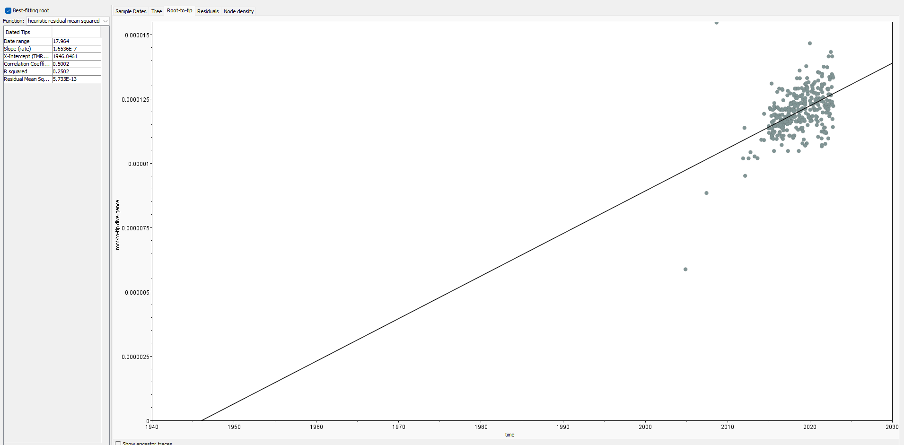
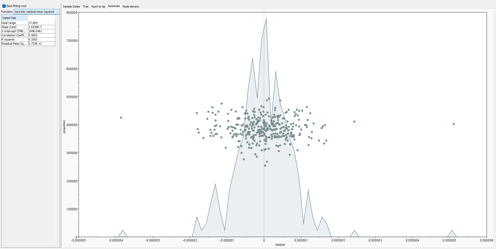
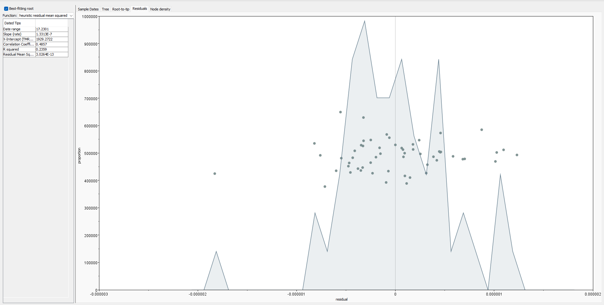
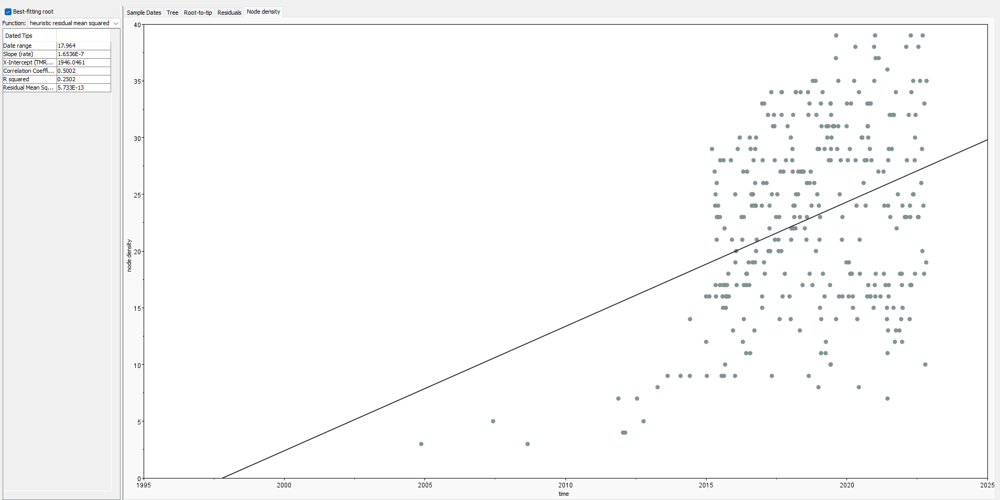
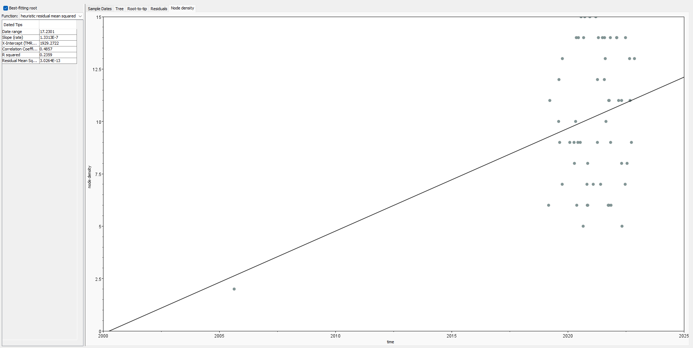

# Molecular Clock Analyses — *Salmonella* Bovismorbificans ST377 & Give ST654

This page documents the step-by-step workflow used to perform temporal phylogenetic analyses for two *Salmonella* serovars as part of my PhD thesis (Chapter 03). The goal was to estimate evolutionary rates, divergence times, and the most recent common ancestor (MRCA) for each dataset using Bayesian molecular clock methods.

---

## Overview of the Workflow

```
SNP alignment (Gubbins) → Temporal signal (TempEst + BactDating) → Model selection (BEAST2 path sampling) → Final BEAST2 run
```

---

## 1. Input Data

The starting point for all temporal analyses was the **recombination-filtered core SNP alignment** generated by Gubbins from each serovar's dataset:

| Dataset | Isolates | SNP sites |
|---|---|---|
| *S.* Bovismorbificans ST377 | 340 | 24,410 |
| *S.* Give ST654 | 55 | 44,498 |

SNP calling was performed using **Clair3** on Oxford Nanopore long reads, with `minimap2` for reference alignment and `BCFtools` for VCF processing. Gubbins was then used to mask recombination regions and produce the final variant-only alignment used as input here.

Maximum-likelihood trees were built from each SNP alignment using **IQ-TREE2**, which also performed substitution model selection:

- ST377 best-fit model: `TVM+F+ASC+R4`
- ST654 best-fit model: `TPM1` (K3P)

These ML trees (with tip dates in the name, format `isolate_name|YYYY-MM-DD`) were used as input for the temporal signal assessments below.

---

## 2. Temporal Signal Assessment

### 2a. TempEst

**TempEst v1.5.3** was used to assess whether there was a clock-like signal in each dataset before committing to Bayesian analysis.

**Steps:**

1. Load the IQ-TREE ML tree into TempEst.
2. Import tip dates — dates were parsed directly from tip names using the `|YYYY-MM-DD` delimiter.
3. Use the **"best-fitting root"** option to find the root position that maximises the R² of the root-to-tip regression.
4. Inspect the root-to-tip vs. sampling date scatter plot.

**What to look for:**
- A positive slope (sequences accumulate substitutions over time)
- R² > 0.3 as a rough threshold for sufficient signal

Both ST377 and ST654 showed positive temporal signal in TempEst, supporting the use of molecular clock models.

**ST377 — Root-to-tip regression (TempEst):**


*Figure: Root-to-tip regression for S. Bovismorbificans ST377. Positive slope and R² indicate temporal signal.*

**ST654 — Root-to-tip regression (TempEst):**


*Figure: Root-to-tip regression for S. Give ST654. Positive slope and R² indicate temporal signal.*

> **Note:** An early test for ST377 that included ~70 low-depth isolates (recovered via Clair3 after Snippy failed) produced a negative slope and a TMRCA projected to 2047 — a red flag. Those isolates were near-clonal to recent isolates but spanned the full date range, adding temporal noise without genetic diversity. They were filtered prior to final analyses.

**ST377 — Residuals (TempEst):**


*Figure: Residuals for S. Bovismorbificans ST377.*

**ST654 — Residuals (TempEst):**


*Figure: Residuals for S. Give ST654.*

**ST377 — Node density (TempEst):**


*Figure: Residuals for S. Bovismorbificans ST377.*

**ST654 — Node density (TempEst):**


*Figure: Residuals for S. Give ST654.*

---

### 2b. BactDating

**BactDating** (R package; Didelot et al.) was used as a complementary temporal signal test, fitting a Bayesian molecular clock model directly in R.

**Script:**

```r
library(BactDating)
library(ape)
library(lubridate)
library(coda)

setwd("path/to/your/dataset/")

# Read ML tree
tree <- read.tree("iqtree_output_YMD.tre")

# Parse tip dates from tip names (format: name|YYYY-MM-DD)
library(stringr)
library(tidyr)
meta <- separate(data.frame(tree$tip.label), col = 1,
                 into = c("name", "date"), sep = "\\|")
dates <- decimal_date(as.Date(meta$date))

# Check that branch lengths are in substitutions (not per site)
# Should be >> 1
sum(tree$edge.length)
# If per-site: tree$edge.length <- tree$edge.length * alignment_length

# Root the tree using sampling dates
tree <- initRoot(tree, dates, mtry = 10, useRec = FALSE)

# Sanity check
allDates(tree)

# Root-to-tip regression (BactDating implementation)
roottotip(tree, dates, showFig = TRUE)

# Fit temporal model (arc = autocorrelated rates)
res <- bactdate(tree, dates, model = "arc", nbIts = 10000000, showProgress = TRUE)

# Check convergence
plot(res, 'trace')
mcmc <- as.mcmc.resBactDating(res)
effectiveSize(mcmc)  # Should be >200

# Fit null model (fixed/randomised dates)
res_null <- bactdate(tree, rep(2010, length(dates)),
                     model = "arc", nbIts = 10000000, showProgress = TRUE)

plot(res_null, 'trace')
mcmc_null <- as.mcmc.resBactDating(res_null)
effectiveSize(mcmc_null)

# Model comparison — Bayes Factor
modelcompare(res, res_null)
# BF >> 1 supports temporal signal
```

**Interpretation:** A Bayes Factor strongly favouring the temporal model over the null model (fixed dates) confirms that sampling dates explain genetic diversity better than chance — i.e., genuine temporal signal is present.

Both ST377 and ST654 passed this test.

**ST377 — BactDating results:**


*Figure: BactDating root-to-tip regression for ST377.*


*Figure: BactDating dated phylogeny for ST377, with 95% credible intervals on node ages.*


*Figure: MCMC trace plot for the ST377 temporal model, showing convergence.*

**ST654 — BactDating results:**


*Figure: BactDating root-to-tip regression for ST654.*


*Figure: BactDating dated phylogeny for ST654, with 95% credible intervals on node ages.*


*Figure: MCMC trace plot for the ST654 temporal model, showing convergence.*

---

## 3. Constant Site Weights

Because BEAST2 receives only the **variable sites (SNPs)** from the Gubbins alignment — not the full genome alignment — it must be told how many invariant sites were removed. Without this correction, BEAST2 overestimates the substitution rate.

Constant site weights (counts of invariant A, C, G, T positions across the reference genome) were calculated with the following Python script:

```python
from collections import Counter
from Bio import SeqIO

def count_constant_sites(full_alignment_file, snp_alignment_file):
    full_records = list(SeqIO.parse(full_alignment_file, "fasta"))
    snp_records  = list(SeqIO.parse(snp_alignment_file,  "fasta"))

    full_length = len(full_records[0].seq)
    snp_length  = len(snp_records[0].seq)
    print(f"Full alignment: {full_length} bp | SNP alignment: {snp_length} bp")
    print(f"Constant sites: {full_length - snp_length}")

    constant_counts = Counter({'A': 0, 'C': 0, 'G': 0, 'T': 0})

    for pos in range(full_length):
        column = [str(r.seq[pos]).upper() for r in full_records]
        if len(set(column)) == 1 and column[0] in 'ACGT':
            constant_counts[column[0]] += 1

    print(f"\nConstant site counts: A={constant_counts['A']:,}  C={constant_counts['C']:,}  "
          f"G={constant_counts['G']:,}  T={constant_counts['T']:,}")
    print(f'\nFor BEAST2 XML:\n'
          f'constantSiteWeights="{constant_counts["A"]} {constant_counts["C"]} '
          f'{constant_counts["G"]} {constant_counts["T"]}"')

count_constant_sites("full_core_alignment.fasta", "snp_only_alignment.fasta")
```

The resulting counts were added to the BEAST2 XML file in the `<data>` block:

```xml
<data id="alignment" dataType="nucleotide"
      constantSiteWeights="A_count C_count G_count T_count">
    ...
</data>
```

For ST377 (reference ~4.71 Mb), the values were approximately:
`constantSiteWeights="1125375 1230664 1230288 1124187"`

---

## 4. Clock Model Selection — BEAST2 Path Sampling

Before running the final BEAST2 analysis, **path sampling (stepping-stone)** was used to compare strict vs. relaxed (uncorrelated lognormal, UCLN) clock models and select the better-supported one.

**Setup in BEAUti:**

1. Load the Gubbins SNP alignment (FASTA).
2. Set tip dates from taxon names (`|YYYY-MM-DD` format, decimal years).
3. Add constant site weights to the XML (see above).
4. **Site model:** TVM (ST377) or TPM1/K3P (ST654), via the SSM (Standard Substitution Models) package.
5. **Clock model:** Strict clock (first run), then Relaxed lognormal clock (second run).
6. **Tree prior:** BICEPS (Bayesian Integrated Coalescent Epoch PlotS).
7. **MCMC tab → change to "Path Sampling"** (requires the MODEL_SELECTION package).
8. Path sampling settings:
   - Alpha: 0.3
   - Steps: 100
   - Chain length per step: 20,000,000–30,000,000
   - Pre-burnin: 1,000,000
   - Burnin: 50%

Each model (strict + relaxed) was submitted as a separate BEAST2 run on NeSI:

```bash
#!/bin/bash
#SBATCH --job-name=beast_ps_strict
#SBATCH --cpus-per-task=8
#SBATCH --mem=32GB
#SBATCH --time=72:00:00

module load BEAST2/2.7.7

beast -threads 8 -seed 12345 path_sampling_strict.xml
```

**Bayes Factor comparison:**

```
ln(BF) = marginal log-likelihood (model A) − marginal log-likelihood (model B)
```

| Model | Marginal log-likelihood |
|---|---|
| Strict clock | reported at end of run |
| Relaxed clock (UCLN) | reported at end of run |

**Clock model chosen — both serovars: Strict clock**

- **ST377:** Path sampling moderately favoured the relaxed clock, but the strict clock produced substantially better ESS values and narrower 95% HPD intervals for key parameters (tree height, clock rate). The strict clock was therefore selected for biological interpretability and mixing quality.
- **ST654:** The difference in marginal likelihoods between models was not significant. The relaxed clock tree height posterior showed multiple peaks, indicating poor convergence. The strict clock was selected.

---

## 5. Final BEAST2 Runs

Final production runs used the settings established above. Three independent MCMC chains were run per dataset to assess convergence.

**ST377 — *S.* Bovismorbificans:**

| Parameter | Setting |
|---|---|
| Substitution model | TVM (via SSM package) |
| Clock model | Strict clock |
| Tree prior | BICEPS |
| Chain length | 600,000,000 |
| Log/tree every | 20,000 |
| Pre-burnin | 1,000,000 |
| Independent runs | 3 |

**ST654 — *S.* Give:**

| Parameter | Setting |
|---|---|
| Substitution model | TPM1 / K3P (via SSM package) |
| Clock model | Strict clock |
| Tree prior | BICEPS |
| Chain length | 90,000,000 |
| Log/tree every | 5,000 |
| Pre-burnin | 1,000,000 |
| Independent runs | 3 |

**NeSI SLURM script (example):**

```bash
#!/bin/bash
#SBATCH --job-name=beast_ST377_run1
#SBATCH --cpus-per-task=16
#SBATCH --mem=64GB
#SBATCH --time=120:00:00
#SBATCH --output=beast_ST377_run1_%j.out

module load BEAST2/2.7.7

beast -threads 16 -seed 111 ST377_strict_TVM_BICEPS_600mi.xml
```

---

## 6. Convergence Assessment

Log files from all three runs were inspected in **Tracer v1.7.2** after removing 10% burnin:

- All key parameters (tree height, clock rate, population size) had **ESS > 200**.
- Trace plots showed good mixing (no trends, no stuck chains).
- The three independent runs were combined using **LogCombiner** (10% burnin per run).

The combined MCC (Maximum Clade Credibility) tree was summarised using **TreeAnnotator**:

```bash
# Combine log files
logcombiner -burnin 10 -log run1.log -log run2.log -log run3.log -o combined.log

# Combine tree files
logcombiner -burnin 10 -log run1.trees -log run2.trees -log run3.trees -o combined.trees

# Summarise MCC tree
treeannotator -burnin 0 -heights mean combined.trees MCC_tree.tre
```

The resulting MCC tree with mean node heights was used for all figures in the thesis.

---

## Software Versions

| Software | Version |
|---|---|
| BEAST2 | 2.7.7 |
| BEAUti | 2.7.7 (bundled) |
| SSM package | via BEAST2 package manager |
| BICEPS package | via BEAST2 package manager |
| MODEL_SELECTION package | via BEAST2 package manager |
| TempEst | 1.5.3 |
| BactDating | R package (GitHub: xavierdidelot/BactDating) |
| Tracer | 1.7.2 |
| LogCombiner / TreeAnnotator | bundled with BEAST2 |
| IQ-TREE2 | 2.x |
| Gubbins | 3.x |
| Clair3 | latest |
| Python | 3.x + Biopython |
| R | 4.x + lubridate, coda, ape |

---

## Key References

- Bouckaert R et al. (2014). BEAST 2: A Software Platform for Bayesian Evolutionary Analysis. *PLOS Computational Biology*.
- Bouckaert R (2022). BICEPS: Bayesian Integrated Coalescent Epoch PlotS. *Ecology and Evolution*.
- Rambaut A et al. (2016). Exploring the temporal structure of heterochronous sequences using TempEst. *Virus Evolution*.
- Didelot X et al. (2021). Bayesian inference of ancestral dates on bacterial phylogenetic trees. *Nucleic Acids Research*.
- Baele G et al. (2012). Improving the accuracy of demographic and molecular clock model comparison while accommodating phylogenetic uncertainty. *Molecular Biology and Evolution*.
