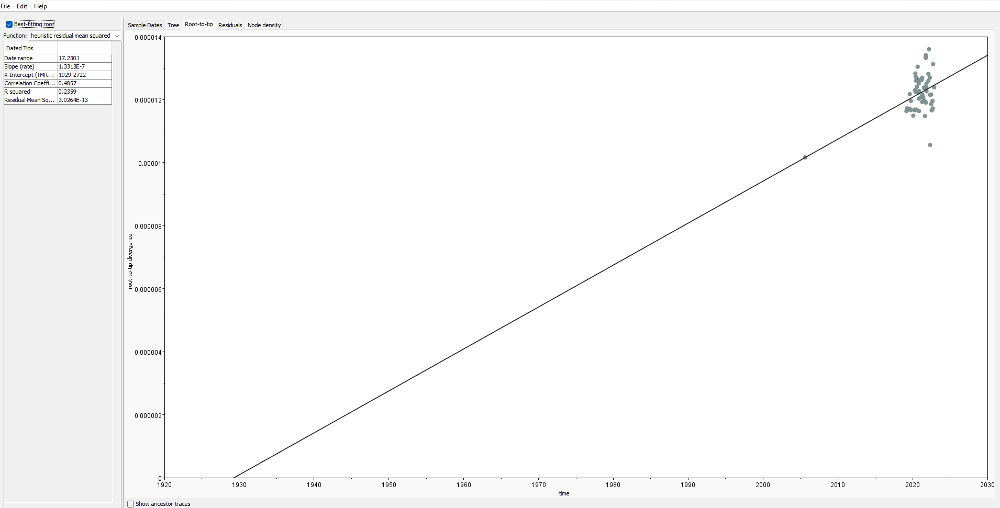

# Molecular Clock Analyses — *Salmonella* Bovismorbificans ST377 & Give ST654

This page shows the TempEst results for two *Salmonella* serovars as part of my PhD thesis (Chapter 03).

---

## 1. Temporal Signal Assessment with TempEst

**TempEst v1.5.3** was used to assess whether there was a clock-like signal in each dataset before committing to Bayesian analysis.

**Steps:**

1. Load the IQ-TREE ML tree into TempEst.
2. Import tip dates — dates were parsed directly from tip names using the `|YYYY-MM-DD` delimiter.
3. Use the **"best-fitting root"** option to find the root position that maximises the R² of the root-to-tip regression.
4. Inspect the root-to-tip vs. sampling date scatter plot.

**What to look for:**
- A positive slope (sequences accumulate substitutions over time)
- R² > 0.3 as a rough threshold for sufficient signal

Both ST377 and ST654 showed positive temporal signal in TempEst, supporting the use of molecular clock models.

**ST377 — Root-to-tip regression (TempEst):**

*Figure: Root-to-tip regression for S. Bovismorbificans ST377. Positive slope and R² indicate temporal signal.*

**ST654 — Root-to-tip regression (TempEst):**

*Figure: Root-to-tip regression for S. Give ST654. Positive slope and R² indicate temporal signal.*

> **Note:** An early test for ST377 that included ~70 low-depth isolates (recovered via Clair3 after Snippy failed) produced a negative slope and a TMRCA projected to 2047 — a red flag. Those isolates were near-clonal to recent isolates but spanned the full date range, adding temporal noise without genetic diversity. They were filtered prior to final analyses.

**ST377 — Residuals (TempEst):**

*Figure: Residuals for S. Bovismorbificans ST377.*

**ST654 — Residuals (TempEst):**

*Figure: Residuals for S. Give ST654.*

**ST377 — Node density (TempEst):**

*Figure: Residuals for S. Bovismorbificans ST377.*

**ST654 — Node density (TempEst):**

*Figure: Residuals for S. Give ST654.*

---

## Software Versions

| Software | Version |
| TempEst | 1.5.3 |

---

## Key References

- Rambaut A et al. (2016). Exploring the temporal structure of heterochronous sequences using TempEst. *Virus Evolution*.
